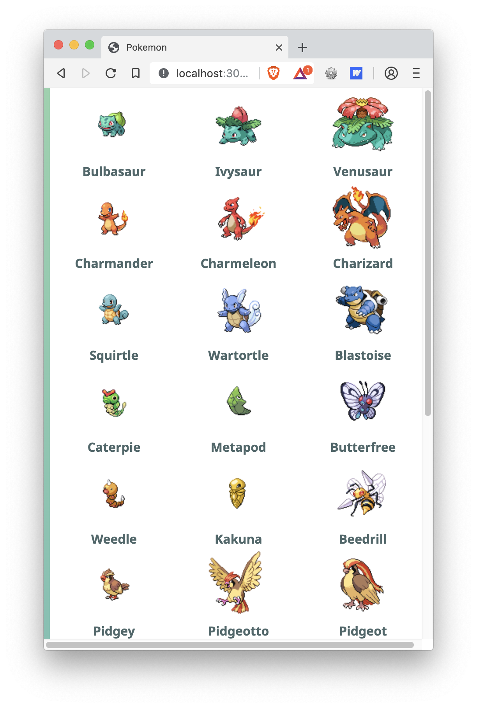
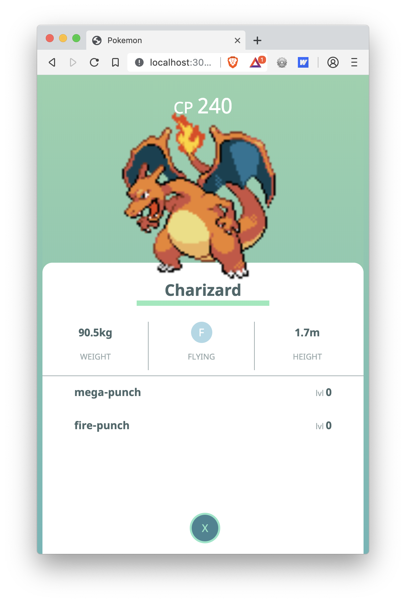
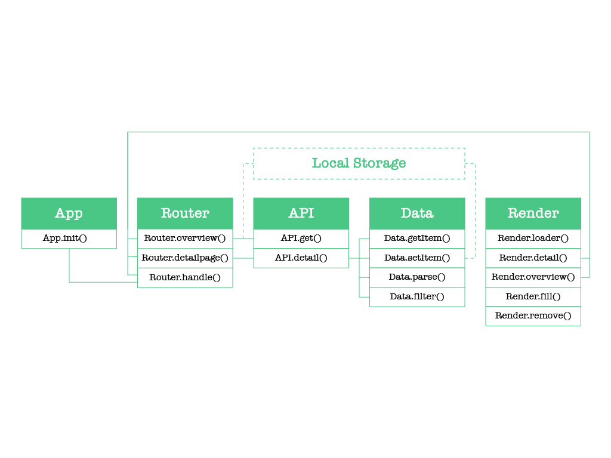
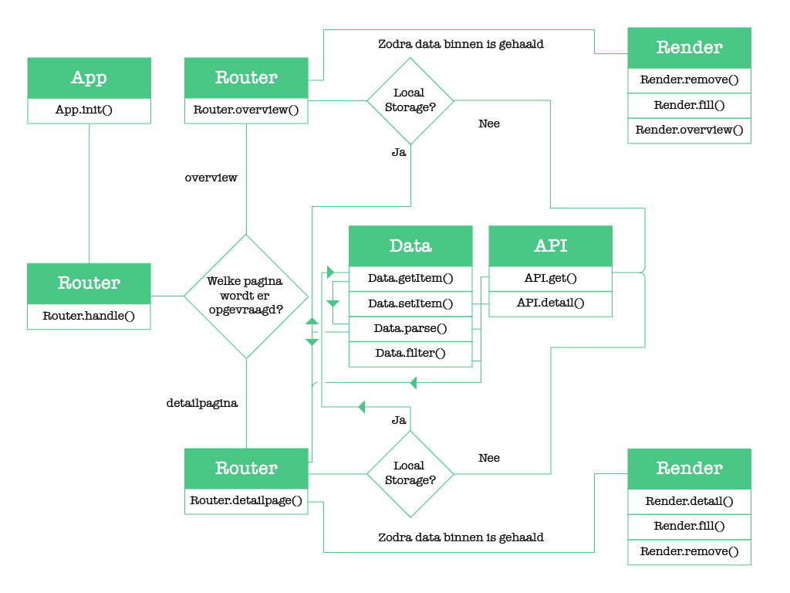

🎓 **Web App From Scratch @cmda-minor-web 18-19**

# PokeAPI

Deze applicatie bevat de data van de [pokéAPI](https://pokeapi.co/). De API bevat onder andere gedetailleerde informatie over een specifieke Pokemon, waaronder type, kracht, movesets en in-game afbeeldingen. De API heeft diverse end-points en door verschillende end-point te combineren kunnen er leuke samenstellingen ontstaan.

> "All the Pokémon data you'll ever need in one place, easily accessible through a modern RESTful API."





Bekijk hier live de[demo](link)!

## Installeren

```
git clone https://github.com/RobinStut/web-app-from-scratch-18-19.git

cd web-app-from-scratch-18-19/
```

## Over de data

De data wordt opgehaald door middel van een Fetch request. Een Fetch request is een gemakkelijke mannier om een HTTP response terug te krijgen. De ontvangen data kan daarna worden omgezet naar JSON.

### Data
De data die omgezet wordt naar JSON ziet er als volgt uit:

```JSON {
  "count": 964,
  "next": "https://pokeapi.co/api/v2/pokemon/?offset=30&limit=30",
  "previous": null,
  "results": [
    {
      "name": "bulbasaur",
      "url": "https://pokeapi.co/api/v2/pokemon/1/"
    },
    {
      "name": "ivysaur",
      "url": "https://pokeapi.co/api/v2/pokemon/2/"
    },
    {
      "name": "venusaur",
      "url": "https://pokeapi.co/api/v2/pokemon/3/"
    },
  ]
}
```

In deze data bevindt zich de url naar de API van de detailpagina van de desbetreffende Pokemon.
De data die deze url bevat ziet er als volgt uit:

```JSON {
  "id": 12,
  "name": "butterfree",
  "base_experience": 178,
  "height": 11,
  "is_default": true,
  "order": 16,
  "weight": 320,
  "abilities": [
    {
      "is_hidden": true,
      "slot": 3,
      "ability": {
        "name": "tinted-lens",
        "url": "https://pokeapi.co/api/v2/ability/110/"
      }
    }
  ],
  "forms": [
    {
      "name": "butterfree",
      "url": "https://pokeapi.co/api/v2/pokemon-form/12/"
    }
  ],
  "game_indices": [
    {
      "game_index": 12,
      "version": {
        "name": "white-2",
        "url": "https://pokeapi.co/api/v2/version/22/"
      }
    }
  ],
  "held_items": [
    {
      "item": {
        "name": "silver-powder",
        "url": "https://pokeapi.co/api/v2/item/199/"
      },
      "version_details": [
        {
          "rarity": 5,
          "version": {
            "name": "y",
            "url": "https://pokeapi.co/api/v2/version/24/"
          }
        }
      ]
    }
  ],
  "location_area_encounters": [
    {
      "location_area": {
        "name": "kanto-route-2-south-towards-viridian-city",
        "url": "https://pokeapi.co/api/v2/location-area/296/"
      },
      "version_details": [
        {
          "max_chance": 10,
          "encounter_details": [
            {
              "min_level": 7,
              "max_level": 7,
              "condition_values": [
                {
                  "name": "time-morning",
                  "url": "https://pokeapi.co/api/v2/encounter-condition-value/3/"
                }
              ],
              "chance": 5,
              "method": {
                "name": "walk",
                "url": "https://pokeapi.co/api/v2/encounter-method/1/"
              }
            }
          ],
          "version": {
            "name": "heartgold",
            "url": "https://pokeapi.co/api/v2/version/15/"
          }
        }
      ]
    }
  ],
  "moves": [
    {
      "move": {
        "name": "flash",
        "url": "https://pokeapi.co/api/v2/move/148/"
      },
      "version_group_details": [
        {
          "level_learned_at": 0,
          "version_group": {
            "name": "x-y",
            "url": "https://pokeapi.co/api/v2/version-group/15/"
          },
          "move_learn_method": {
            "name": "machine",
            "url": "https://pokeapi.co/api/v2/move-learn-method/4/"
          }
        }
      ]
    }
  ],
  "species": {
    "name": "butterfree",
    "url": "https://pokeapi.co/api/v2/pokemon-species/12/"
  },
  "sprites": {
    "back_female": "http://pokeapi.co/media/sprites/pokemon/back/female/12.png",
    "back_shiny_female": "http://pokeapi.co/media/sprites/pokemon/back/shiny/female/12.png",
    "back_default": "http://pokeapi.co/media/sprites/pokemon/back/12.png",
    "front_female": "http://pokeapi.co/media/sprites/pokemon/female/12.png",
    "front_shiny_female": "http://pokeapi.co/media/sprites/pokemon/shiny/female/12.png",
    "back_shiny": "http://pokeapi.co/media/sprites/pokemon/back/shiny/12.png",
    "front_default": "http://pokeapi.co/media/sprites/pokemon/12.png",
    "front_shiny": "http://pokeapi.co/media/sprites/pokemon/shiny/12.png"
  },
  "stats": [
    {
      "base_stat": 70,
      "effort": 0,
      "stat": {
        "name": "speed",
        "url": "https://pokeapi.co/api/v2/stat/6/"
      }
    }
  ],
  "types": [
    {
      "slot": 2,
      "type": {
        "name": "flying",
        "url": "https://pokeapi.co/api/v2/type/3/"
      }
    }
  ]
}
```


Nadat alle data is ontvangen, kies ik ervoor om de volgende data te behouden:
```JSON {
  "id": 12,
  "name": "butterfree",
  "base_experience": 178,
  "height": 11,
  "weight": 320,

  "moves": [
    {
      "move": {
        "name": "flash",
        "url": "https://pokeapi.co/api/v2/move/148/"
      },
      
    }
  ],
  "sprites": {
    "front_default": "http://pokeapi.co/media/sprites/pokemon/12.png"
  },
  "stats": [
    {
      "base_stat": 70,
    }
  ],
  "types": [
    {
      "slot": 2,
      "type": {
        "name": "flying",
        "url": "https://pokeapi.co/api/v2/type/3/"
      }
    }
  ]
}

```

### Het renderen van de data

Om data te renderen heb ik 2 methodes gebruikt. De belangrijkste methode is de insertAdjacentHTML methode. Met deze methode is het gemakkelijk aan te geven waar de data geplaatst moet worden. Zo heb ik er voor gekozen om data achter een bestaand element te renderen.
Ook heb ik gebruik gemaakt van innerHTML. Deze methode gebruik ik om bestaande code te overschrijven met lege inhoud.

## Hoe werkt de app?

### Actor Diagram

De actor diagram laat zien wie welke functionaliteit afhandelt in de app.



### Interaction Diagram

De interaction diagram laat zien hoe de functionaliteit tot stand komt binnen de app.

