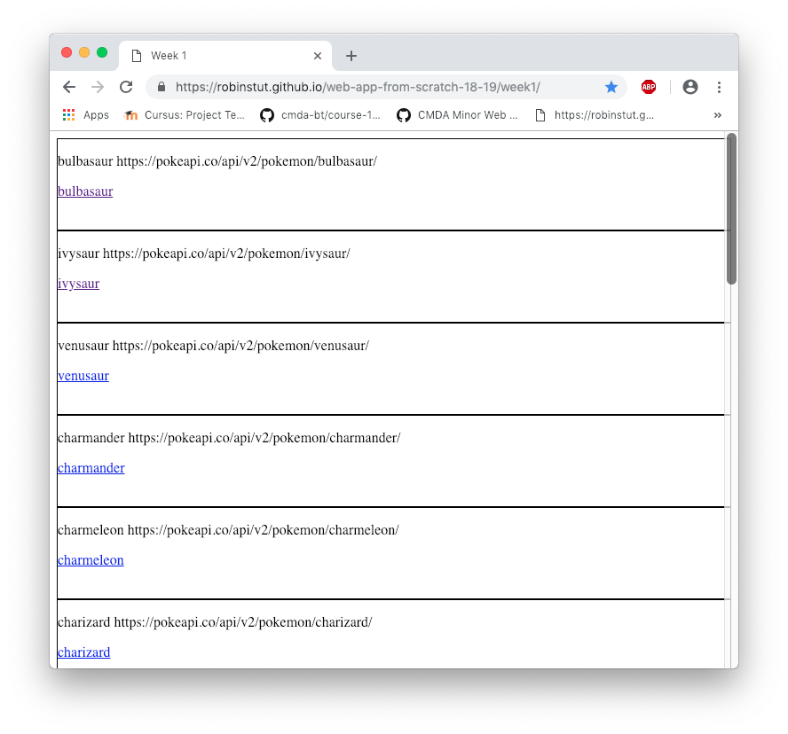

**Web App From Scratch @cmda-minor-web 18-19**

# Pokémon API

The API I’m using contains all the Pokémon names existing and an URL to the detail page. Every detail page needs his own API request and the data contains all the information about the Pokémon and in which games it participated. There is a restriction on the API which forces me to only load 20 Pokemon’s at a time. 




Visit the [website](https://robinstut.github.io/web-app-from-scratch-18-19/week1/)!


## How to install

```
git clone https://github.com/RobinStut/web-app-from-scratch-18-19.git

cd web-app-from-scratch-18-19/week1
```

## The data itself 

The data will be received by a request to the API. The request method I’m using at the moment is a 'XMLHttpRequest', which I will adapt to an 'async/await' or 'promise' based request later on.

### `API Request` (XHR)

The API request I used is happening by a XMLHttpRequest. This allows me to get data from a specific (external) source. With the help of MDN, you are able to see how I did this:  [here](https://github.com/RobinStut/web-app-from-scratch-18-19/blob/master/week1/public/js/app.js).

Source: [MDN](https://developer.mozilla.org/en-US/docs/Web/API/XMLHttpRequest/Synchronous_and_Asynchronous_Requests)


### API Data

The data I get from the API request can be seen on this link: ‘https://pokeapi.co/api/v2/pokemon' and a detail page on this link:https://pokeapi.co/api/v2/pokemon/bulbasaur/ 

The result I get is:

```json
{"count":964,"next":"https://pokeapi.co/api/v2/pokemon/?offset=20&limit=20","previous":null,"results":[{"name":"bulbasaur","url":"https://pokeapi.co/api/v2/pokemon/1/"},{"name":"ivysaur","url":"https://pokeapi.co/api/v2/pokemon/2/"},{"name":"venusaur","url":"https://pokeapi.co/api/v2/pokemon/3/"},{"name":"charmander","url":"https://pokeapi.co/api/v2/pokemon/4/"},{"name":"charmeleon","url":"https://pokeapi.co/api/v2/pokemon/5/"},{"name":"charizard","url":"https://pokeapi.co/api/v2/pokemon/6/"},{"name":"squirtle","url":"https://pokeapi.co/api/v2/pokemon/7/"},{"name":"wartortle","url":"https://pokeapi.co/api/v2/pokemon/8/"},{"name":"blastoise","url":"https://pokeapi.co/api/v2/pokemon/9/"},{"name":"caterpie","url":"https://pokeapi.co/api/v2/pokemon/10/"},{"name":"metapod","url":"https://pokeapi.co/api/v2/pokemon/11/"},{"name":"butterfree","url":"https://pokeapi.co/api/v2/pokemon/12/"},{"name":"weedle","url":"https://pokeapi.co/api/v2/pokemon/13/"},{"name":"kakuna","url":"https://pokeapi.co/api/v2/pokemon/14/"},{"name":"beedrill","url":"https://pokeapi.co/api/v2/pokemon/15/"},{"name":"pidgey","url":"https://pokeapi.co/api/v2/pokemon/16/"},{"name":"pidgeotto","url":"https://pokeapi.co/api/v2/pokemon/17/"},{"name":"pidgeot","url":"https://pokeapi.co/api/v2/pokemon/18/"},{"name":"rattata","url":"https://pokeapi.co/api/v2/pokemon/19/"},{"name":"raticate","url":"https://pokeapi.co/api/v2/pokemon/20/"}]}
```

Like I said earlier, the API restricts me from retrieving more than 20 results, but can be bypassed by adapting the API link. The data I use for now is very small, but will be extended by some data from every detail page.

## About Web App From Scratch

I'm working on this application during the Web App From Scratch course. During this course we focus on building a native HTML, CSS & JavaScript application, so no frameworks or unnecessary libraries.

### Schedule 

**Week 1** Hello API 🐒

- [x] In week 1 we get used to pick up data from an API and render that in HTML.

[Repository](https://github.com/RobinStut/web-app-from-scratch-18-19/blob/master/week1/public/js/app.js)

**Week 2** - Design and Refactor 🛠

- [ ] In week 2 we try to make breakdowns in the web app. Also we will be adding routes and multiple states. A detail page will be rendered as well.

[Repository]()

**Week 3**- Wrapping up 🎁

- [ ] In week 3 we try to manipulating data, Splitting code into modules and reflect with each other  on the end results

[Repository]()


